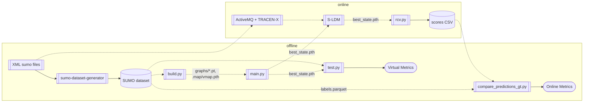
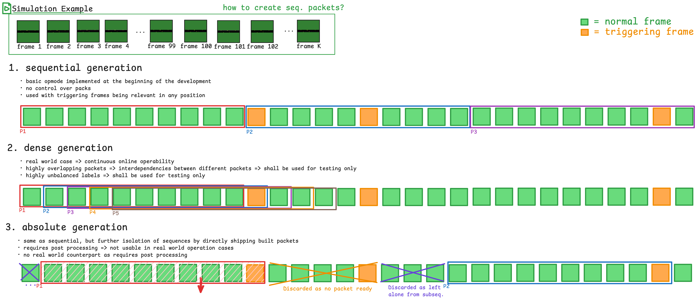

# SUMO Dataset Generator

Synthetic dataset generator from **SUMO** simulations, developed for the MSc thesis *"AI events prediction for centralized Server Local Dynamic Map connected vehicle service"* and as an integration of the [S-LDM](https://github.com/DriveX-devs/S-LDM) research project.

This toolset is designed to orchestrate plausible vehicle simulations in SUMO and analyze them in order to produce structured datasets, organized in frame sequences grouped in packs. Each pack is also assigned some multi-class labels encoded as a bitmask in the `MLBEncoded` column (see `sumodetector/labels.py`), implementing the logic for the generation of Ground Truths.

| Index | Label         | Bit value | GT Logic / Meaning  |
| ----- | ------------- | --------- | ------------------- |
| 0     | `LANE_CHANGE` | 1         | Lateral change in lane: in SUMO detected, as a vehicle changing lane within the same edge. |
| 1     | `OVERTAKE`    | 2         | A vehicle passes its previous leader on the same edge. |
| 2     | `TURN`        | 4         | A vehicle leaves a lane and does not continue on the straightest outgoing lane. |
| 3     | `COLLISION`   | 8         | Collision betwee vehicles, automatically reported by SUMO. |

The development has been motivated by the need of task-specific datasets for training of proper AI models aimed at detecting *triggering events* from S-LDM data; such AI models are intended as an alternative/replacement for the previous ruleset-like deterministic system (e.g., "turn signal inserted → turn").
The reference GNN model consuming the dataset is available in the [sldm-gnn](https://github.com/aledima00/sldm-gnn) repository.

> Even if multi-label by-design to support future architecture merging, at the moment each label has its own training pipeline, thus requiring a custom label-specific dataset.

## Installation

The project is managed with [`uv`](https://docs.astral.sh/uv/), which fetches the required Python (3.13, per `requires-python`) and builds an isolated project venv (`.venv/`) to achieve isolation and reproducibility, and preventing conflicts. No system Python or global installs needed, avoiding interference with the host's interpreter and libraries.

To install `uv`:

```bash
curl -LsSf https://astral.sh/uv/install.sh | sh
```

Then, once cloned the repository, install the dependencies with:

```bash
uv sync
```

> **Note:** the project depends on `traci>=1.24.0` and `sumolib>=1.24.0`. Make sure the installed **SUMO** binary (reachable from `PATH` through the `sumo`/`sumo-gui` binaries) is compatible with these libraries.

Then, to automatically run python scripts with the correct venv, the user is encouraged to run each script with `uv run <script>` rather than `python3 <script>`.

## Code layout

The code is organized providing some major CLI entrypoints:
- `gen.py` reads the generation parameters, writes the SUMO configuration file and produces routes/vehicles;
- `sim.py` runs the simulation, extracts frame packs from the S-LDM data flow and writes the labeled parquet dataset;
- `lbstats.py` is a small utility for label distribution analysis.

Route and vehicle generation is handled by the `genrouter` module, while frame extraction, buffering and labeling is handled by the `sumodetector` module.

```
gen.py, sim.py, lbstats.py                                      # CLI entrypoints
genrouter/                # route & vehicle generation from gparams.yaml
  README.md               # detailed genrouter documentation
sumodetector/             # frame extraction, pack buffering and labeling
  README.md               # detailed sumodetector documentation
  labels.py               # LabelsEnum
utils/                    # gparams schema
pyproject.toml            # project configuration and dependencies
LICENSE                   # GPLv2
```

For in-depth documentation on modules, classes, CLI options, and configuration parameters, see their CLI description below.

## Data layout

A minimal scenario folder passed to `gen.py`/`sim.py` should have shape as in the following:

```
<scenario_path>/
  map.net.xml              # SUMO road network
  gparams.yaml             # vehicle and route generation parameters
  cfg.sumocfg              # written by gen.py (time and step parameters)
  routes.rou.xml           # written by gen.py (routes and vehicles)
```

The `gparams.yaml` file controls route and vehicle generation. It is better documented [below](#genpy).

After running `sim.py`, the output directory contains the following parquet files:

| File | Description |
|------|-------------|
| `vmap.parquet` | Vector representation of the road network. |
| `packs.parquet` | Vehicle frame packs. Columns: `VehicleId`, `X`, `Y`, `Speed`, `Angle`, `FrameId`, `PackId`. |
| `labels.parquet` | Pack-associated multi-labels. Columns `PackId`, `MLBEncoded`. |
| `vinfo.parquet` | Static vehicle information. Columns: `VehicleId`, `Width`, `Length`, `StationType`. |

You can also refer to this schema to better understand the full work pipeline (this repo corresponds to the `sumo-dataset-generator` node):



---

# CLI reference

All entrypoints are based on the `click` python library. Run `uv run <script> --help` for the live option list.

The workflow is divided in two main phases:
1. **scenario preparation**: create a scenario folder with `map.net.xml` and `gparams.yaml` and use that to generate the simulation config files via the `gen.py` script;
2. **dataset generation**: run `sim.py` after the config is ready to run the simulation and analyze it to produce the dataset;

Some examples of `map.net.xml` and `gparams.yaml` for **scenario preparation** have been included in the [`examples/`](./examples/) directory, specifically providing them for the train split of the 4 labels considered:

```
examples/
├── l0_lanechange_train/
│   ├── map.net.xml
│   └── gparams.yaml
├── l1_overtake_train/
│   ├── map.net.xml
│   └── gparams.yaml
├── l2_turn_train/
│   ├── map.net.xml
│   └── gparams.yaml
└── l3_collision_train/
    ├── map.net.xml
    └── gparams.yaml
```

Actually, while `gparams.yaml` varies for each label aiming to achieve label-specific class balance, the map is always the same, so the `map.net.xml` is actually only provided in `examples/0_lanechange_train/`, but it is not repeated in the others, so for real usage of another dir (l1,l2,l3,...) the map file should be pasted in the desired config dir.

## gen.py

`gen.py` is a CLI for `genrouter`, which is responsible for producing the SUMO configuration for the simualation, starting from a road network `map.net.xml` and a YAML configuration `gparams.yaml` (`<yfname>` is a directory, it automatically looks for `gparams.yaml` inside it, otherwise it expects a `.yaml` file to be used directly).

After reading such input files, the script:
- writes `cfg.sumocfg` (or updates if already present without touching other customized fields) with `time` and `step_len` as provided
- generates the `routes.rou.xml` file with routes and vehicles

**Usage**

```
uv run gen.py <yfname>
```

There is no additional option available, the user must only specify the given argument, that can be either:
- a directory containing `gparams.yaml` and `cfg.sumocfg`
- a path to a `gparams.yaml` file directly

An YAML configuration file should look like the snippet provided below:
```yaml
time: 3600          # total simulation time [s]
split: 1            # 1 = single simulation, >1 = split into independent sub-simulations dividing time and vnum
steplen: 0.1        # simulation step length [s]
nroutes: 100        # number of routes to generate
minrtlen: 10        # minimum route length [edges]
maxrtlen: 20        # maximum route length [edges]
vnum: 100           # number of vehicles to generate

# How vehicle departure times are sampled.
vDrawMethod:
  name: "TimeMovingGaussian"    # vehicle insertion time drawing method
  tdevprop: 0.15                # standard deviation as a fraction of total simulation time
  onBorders: "Redistribute"     # redraw out-of-bounds values uniformly within range
  sigmaScaling: "Triangular"    # reduce variance near start/end of simulation

# Distribution of SUMO vehicle classes (e.g., CITIZEN, POLICE, EMERGENCY, ... )
ClassParams:
- { p: 1.0, name: "CITIZEN", vClass: "passenger" }
# other categories of ClassParams ...

# Distribution of drivers' behavior parameter sets (NORMAL, CAUTIOUS, AGGRESSIVE, ...)
IndividualParams:
- { p: 1.0, name: "NORMAL_DRIVER",  minGap: 2.5, speedFactor: 1.0, speedDev: 0.1, lcGreediness: 0.5, lcAggressiveness: 0.1, jcAggressiveness: 0.1 }
# other categories of IndividualParams ...

# Distribution of physical vehicle parameter sets (CAR, TRUCK, SCOOTER, ...)
VehicleParams:
- { p: 1.0, name: "CONSUMER_CAR", stType: 5, accel: 2.6, decel: 4.5, emergency_decel: 9.0, length_m: 5.0, width_m: 1.8, max_speed: 180.0, gui_shape: "passenger" }
# other categories of VehicleParams ...

# Optional random behavioral modifiers.
# Modifiers:...
```

At the end, a summary of the generation is logged on the terminal.

**Example**

```bash
uv run gen.py examples/turn/valid
```

The non-trivial options in the YAML file are described below.

### Departure time methods (`vDrawMethod`)

The `vDrawMethod` object is used to decide when the vehicles are inserted in the simulation after being created and associated to a route.
The object can be configured with different fields, and the general behavior is decided by the `name` field, which the user can choose among three options:
- **`Uniform`** - departures sampled uniformly in `[0, sim_time]`
- **`FixedAbsGaussian`** - departures sampled from a gaussian centered at `0` with `sigma = time * tdevprop`. `tdevprop` should be provided as a field of hte object.
- **`TimeMovingGaussian`** - each vehicle has its own gaussian, whose mean moves linearly across the simulation time; variance can be reduced near the boundaries with `sigmaScaling` field, that can be either `None/Triangular/Quadratic`.

Also, as latter two options exploits gaussian distribution, it should be considered that there is a non-zero probability of falling out of simulation borders: for this reason, for these two options, the object includes a field `onBorders`, which can have either values `Clamp`, limiting the value to the min-max interval, or `Redistribute`, forcing a redraw until falling in the interval.

### Modifiers

Modifiers are applied to a vehicle with probability `p`.
They are designed for custom property modifications, so they should be defined in the source code.
Currently, only the following 2 are supported:

```yaml
Modifiers:
  - { p: 0.1, name: "DISTRACTED_DRIVER", reactionTimeAvg: 1.0, reactionTimeDev: 0.2 }
  - { p: 0.1, name: "UNEXPECTED_DECEL", decelPropAvg: 0.5, decelPropDev: 0.1 }
```

in particular:
- `DISTRACTED_DRIVER` increases the driver's reaction time (`actionStepLength`) by sampling from a Gaussian
- `UNEXPECTED_DECEL` reduces the vehicle's `apparentDecel` relative to its real `decel`, making it brake less effectively than expected.

## sim.py

Runs the SUMO simulation via TraCI, and extracts labeled vehicle frame packs. Labels are obtained as ground truths for triggering events. The output is saved to `<outdir>` as a `parquet` dataset. Each run targets a single active label `<label>`.

**Usage**

```
uv run sim.py -L <label> --outdir <output_dir> [options] <scenario_path>
```

**Options**

| Option                                  | Default     | Required | Description                                                                                          |
| --------------------------------------- | ----------- | -------- | --------------------------------------------------------------------------------------------------- |
| `-L, --label`                           | -           | ✓        | Index of the active label to extract.                                             |
| `--outdir`                              | -           | ✓        | Output directory for the parquet dataset.                                                           |
| `-g, --gui`                             | off         |          | Runs SUMO with the GUI (only in single-threaded mode).                                                                              |
| `-W, --no-warnings`                     | off         |          | Suppress SUMO warnings.                                                                             |
| `-E, --enable-emergency-insertions`     | off         |          | Enable insertion of vehicles in the simulation even in emergency situations.                                          |
| `-p, --pack-size`                       | 20          |          | Number of frames in each pack.                                                                      |
| `--on-collision`                        | none        |          | Action on collision: `teleport`, `warn`, `none`, `remove`.                                         |
| `-d, --delay`                           | no delay    |          | Delay in ms between simulation steps (useful with GUI).                                            |
| `-T, --threads`                         | 1           |          | Number of parallel workers for multi-threaded simulation. Leave 1 for single-threaded mode.                                         |
| `-S, --split`                           | off         |          | Use `partN/` subfolders generated with split configuration (only in multi-threaded mode with number of threads matching the numer of parts).                  |
| `--map-only`                            | off         |          | Only extract the vector map (`vmap.parquet`) and exit.                                             |
| `--tar`                                 | off         |          | Create a `.tar` archive of the output directory after simulation.                                  |
| `-O, --opmode`                          | `absolute`  |          | Pack building mode: `absolute`, `dense`, `sequential`.                                             |

**Example**

```bash
uv run sim.py -L 2 --outdir ./out/turn_valid --pack-size 20 -T 4 examples/turn/valid
```

Runs the simulation on the `turn/valid` scenario extracting packs labeled as `TURN` (index 2), with pack size 20 and 4 parallel workers.

### Multi-threading

Use `-T N` to run the simulation with `N` parallel workers:

- Without `-S`: the total simulation time is split into `N` contiguous slices.
- With `-S`: the module expects `part0/`, ..., `partN-1/` subfolders created by `genrouter` with `split=N`, and runs each part independently.

>  At the end, outputs are merged and `PackIds` are adjusted so they remain unique across workers.

### Pack Building OpModes (`--opmode`)

The `--opmode` controls how frames are grouped into packs when a trigger is detected:

| Mode | Behavior |
|------|----------|
| `sequential` | Firts/MVP implementation: packs are emitted strictly in order as the buffer fills. |
| `absolute` | Trigger emits the last full pack and discards the rest of the buffer. The trigger frame is the last element of the labeled pack. |
| `dense` | Emits a pack whenever enough frames are available; no explicit trigger flush. |


Also, the following image shows the differences schematically



## lbstats.py

Utility for label distribution analysis: prints the total number of samples and the frequency of each label.

**Usage**

```
uv run lbstats.py <labels.parquet>
```

There is no additional option available, the user must only specify the given argument, that is the path of the parquet dataset file associated with the labels.

**Example**

```bash
uv run lbstats.py ./out/turn_valid/labels.parquet
```

---

## License

Distributed under the **GNU General Public License v2.0** — see [`LICENSE`](LICENSE).

## Links

- [S-LDM](https://github.com/DriveX-devs/S-LDM)
- [sldm-gnn](https://github.com/aledima00/sldm-gnn/)
